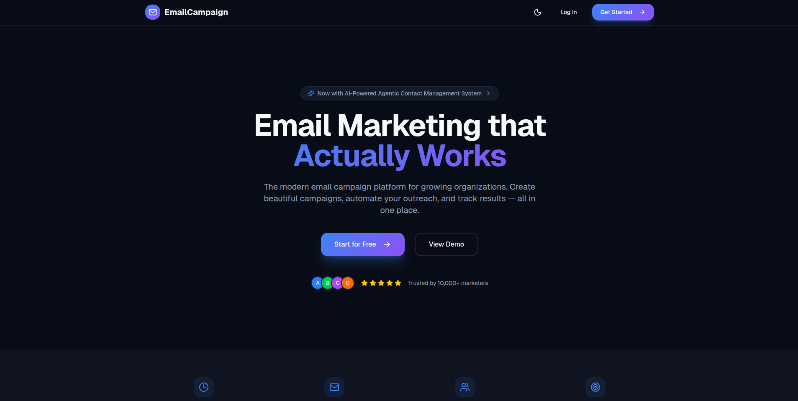

# 📧 Agentic Email Campaign Management Platform

A comprehensive, modern email marketing platform with AI-powered features for managing email campaigns, contact lists, and email templates. Built with Django REST API backend and Next.js frontend with full dark/light theme support.




---

## 📑 Table of Contents

- [Features](#-features)
- [Tech Stack](#-tech-stack)
- [Architecture](#-architecture)
- [Project Structure](#-project-structure)
- [Quick Start with Docker](#-quick-start-with-docker)
- [Manual Development Setup](#-manual-development-setup)
- [API Documentation](#-api-documentation)
- [License](#-license)

---

## ✨ Features

### 🎯 Campaign Management
- Create, edit, and launch email campaigns
- Multi-step campaign wizard with live preview
- Campaign analytics and tracking
- Schedule campaigns for later

### 👥 Contact Management
- Import contacts from CSV
- Create and manage contact lists
- Contact segmentation
- Unsubscribe management

### 📝 Template Builder
- Rich text email editor with HTML support
- AI-powered content generation
- Template categories and tags
- Preview before sending

### 🤖 AI Agent
- Voice-enabled AI assistant
- Natural language contact management
- Smart suggestions and automation

### 🎨 Modern UI/UX
- Responsive design for all devices
- Dark/Light theme with system preference detection
- Smooth animations and transitions
- Custom styled dialogs and notifications

### 🔐 Security
- JWT-based authentication
- Email verification
- Secure password reset
- Role-based permissions

---

## 🛠 Tech Stack

### Backend

| Technology | Purpose |
|------------|---------|
| **Python 3.11+** | Core programming language |
| **Django 5.2** | Web framework |
| **Django REST Framework 3.15** | REST API development |
| **PostgreSQL** | Primary database |
| **Redis** | Caching & Celery broker |
| **Celery 5.3** | Async task queue (email sending) |
| **Celery Beat** | Scheduled tasks |
| **SimpleJWT** | JWT authentication |
| **drf-spectacular** | OpenAPI documentation |
| **Gunicorn/Daphne** | Production WSGI/ASGI servers |
| **Sentry** | Error tracking |

### Frontend

| Technology | Purpose |
|------------|---------|
| **Next.js 16** | React framework with App Router |
| **React 19** | UI library |
| **TypeScript 5** | Type-safe JavaScript |
| **Tailwind CSS 4** | Utility-first CSS framework |
| **Radix UI** | Accessible UI primitives |
| **React Hook Form + Zod** | Form handling & validation |
| **next-themes** | Dark/Light theme management |
| **Lucide React** | Icon library |
| **Sonner** | Toast notifications |
| **Axios** | HTTP client |
| **React Quill** | Rich text editor |

### DevOps & Tooling

| Technology | Purpose |
|------------|---------|
| **Docker & Docker Compose** | Containerization |
| **Nginx** | Reverse proxy (production) |
| **GitHub Actions** | CI/CD pipelines |
| **ESLint** | JavaScript/TypeScript linting |
| **Black & isort** | Python code formatting |
| **Pytest** | Python testing |

---

## 🏗 Architecture

```
┌─────────────────────────────────────────────────────────────────┐
│                         CLIENT LAYER                            │
├─────────────────────────────────────────────────────────────────┤
│  Next.js 16 (React 19 + TypeScript)                            │
│  ├── App Router (Server & Client Components)                   │
│  ├── Tailwind CSS + Radix UI                                   │
│  ├── Theme Provider (Dark/Light)                               │
│  └── Axios HTTP Client                                         │
└─────────────────────────────────────────────────────────────────┘
                              │
                              ▼ REST API (JSON)
┌─────────────────────────────────────────────────────────────────┐
│                         API LAYER                               │
├─────────────────────────────────────────────────────────────────┤
│  Django REST Framework                                          │
│  ├── JWT Authentication (SimpleJWT)                             │
│  ├── ViewSets & Serializers                                     │
│  ├── Permission Classes                                         │
│  └── API Versioning                                             │
└─────────────────────────────────────────────────────────────────┘
                              │
                              ▼
┌─────────────────────────────────────────────────────────────────┐
│                      APPLICATION LAYER                          │
├─────────────────────────────────────────────────────────────────┤
│  Django 5.2                                                     │
│  ├── Authentication App (Users, JWT, Email Verification)       │
│  ├── Campaigns App (Campaigns, Templates, Contacts, Providers) │
│  └── Utils App (Common utilities, Base models)                 │
└─────────────────────────────────────────────────────────────────┘
                              │
              ┌───────────────┼───────────────┐
              ▼               ▼               ▼
┌──────────────────┐ ┌──────────────┐ ┌──────────────────┐
│   PostgreSQL     │ │    Redis     │ │     Celery       │
│   (Database)     │ │   (Cache)    │ │  (Task Queue)    │
└──────────────────┘ └──────────────┘ └──────────────────┘
                                              │
                                              ▼
                                    ┌──────────────────┐
                                    │  Email Services  │
                                    │  (SMTP/SES/etc)  │
                                    └──────────────────┘
```

---

## 📁 Project Structure

### Root Directory

```
Email-Campaign-Management-Platform/
├── 📄 README.md                 # This documentation
├── 📄 LICENSE                   # MIT License
├── 📄 .gitignore               # Git ignore rules
├── 📁 backend/                 # Django REST API
├── 📁 frontend/                # Next.js Application
└── 📁 frontend-newsletter/     # Static newsletter widget
```

### Backend Structure

```
backend/
├── 📄 manage.py                 # Django management script
├── 📄 requirements.txt          # Python dependencies
├── 📄 Dockerfile               # Backend Docker image
├── 📄 docker-compose.yml       # Backend services composition
├── 📄 docker_entrypoint.sh     # Container startup script
├── 📄 core.py                  # Core utilities
│
├── 📁 project_config/          # Django Project Configuration
│   ├── __init__.py
│   ├── settings.py             # Django settings
│   ├── urls.py                 # Root URL configuration
│   ├── wsgi.py                 # WSGI application
│   ├── asgi.py                 # ASGI application
│   └── celery.py               # Celery configuration
│
├── 📁 apps/                    # Django Applications
│   │
│   ├── 📁 authentication/      # User Authentication
│   │   ├── models.py           # User, Organization models
│   │   ├── views.py            # Auth API views
│   │   ├── serializers.py      # DRF serializers
│   │   ├── urls.py             # Auth endpoints
│   │   ├── permissions.py      # Custom permissions
│   │   ├── signals.py          # Django signals
│   │   ├── services/           # Business logic services
│   │   └── migrations/         # Database migrations
│   │
│   ├── 📁 campaigns/           # Campaign Management
│   │   ├── models/             # Campaign, Template, Contact models
│   │   ├── views/              # Campaign API views
│   │   ├── serializers/        # DRF serializers
│   │   ├── urls.py             # Campaign endpoints
│   │   ├── tasks.py            # Celery tasks
│   │   ├── signals.py          # Django signals
│   │   ├── constants.py        # App constants
│   │   ├── exceptions.py       # Custom exceptions
│   │   ├── backends.py         # Email backends
│   │   ├── utils/              # Helper utilities
│   │   └── migrations/         # Database migrations
│   │
│   └── 📁 utils/               # Shared Utilities
│       ├── base_models.py      # Abstract base models
│       ├── pagination.py       # Custom pagination
│       ├── filters.py          # Query filters
│       ├── responses.py        # Response helpers
│       ├── throttles.py        # Rate limiting
│       ├── mixins.py           # View mixins
│       └── exceptions.py       # Base exceptions
│
├── 📁 core/                    # Core Module
│   ├── utils.py                # Utility functions
│   ├── mixins.py               # Model mixins
│   └── exceptions.py           # Core exceptions
│
├── 📁 static/                  # Static files
├── 📁 media/                   # User uploads
└── 📁 media_files/             # Media storage
    ├── logos/                  # Organization logos
    └── profiles/               # Profile images
```

### Frontend Structure

```
frontend/
├── 📄 package.json              # Node.js dependencies
├── 📄 tsconfig.json            # TypeScript configuration
├── 📄 next.config.ts           # Next.js configuration
├── 📄 postcss.config.mjs       # PostCSS configuration
├── 📄 eslint.config.mjs        # ESLint configuration
├── 📄 Dockerfile               # Frontend Docker image
├── 📄 docker-compose.yml       # Frontend services composition
│
├── 📁 app/                     # Next.js App Router
│   ├── 📄 layout.tsx           # Root layout
│   ├── 📄 page.tsx             # Landing page
│   ├── 📄 globals.css          # Global styles & theme
│   │
│   ├── 📁 login/               # Login page
│   │   └── page.tsx
│   ├── 📁 signup/              # Signup page
│   │   └── page.tsx
│   ├── 📁 verify-email/        # Email verification
│   │   └── page.tsx
│   │
│   └── 📁 dashboard/           # Protected Dashboard
│       ├── layout.tsx          # Dashboard layout
│       ├── page.tsx            # Dashboard home
│       │
│       ├── 📁 campaigns/       # Campaign Management
│       │   ├── page.tsx        # Campaign list
│       │   ├── 📁 new/         # Create campaign
│       │   └── 📁 [id]/        # Campaign details
│       │
│       ├── 📁 contacts/        # Contact Management
│       │   ├── page.tsx        # Contact list
│       │   ├── 📁 new/         # Add contact
│       │   ├── 📁 import/      # Import contacts
│       │   └── 📁 [id]/        # Contact details
│       │
│       ├── 📁 templates/       # Template Management
│       │   ├── page.tsx        # Template list
│       │   └── 📁 new/         # Create template
│       │
│       ├── 📁 settings/        # Settings
│       │   └── 📁 providers/   # Email provider config
│       │       ├── page.tsx
│       │       └── 📁 new/
│       │
│       └── 📁 profile/         # User profile
│           └── page.tsx
│
├── 📁 components/              # React Components
│   ├── 📄 editor.tsx           # Rich text editor
│   ├── 📄 providers.tsx        # App providers
│   │
│   ├── 📁 dashboard/           # Dashboard Components
│   │   ├── sidebar.tsx         # Navigation sidebar
│   │   ├── header.tsx          # Top header bar
│   │   └── FloatingAgentInput.tsx  # AI agent input
│   │
│   └── 📁 ui/                  # UI Components (Radix-based)
│       ├── alert-dialog.tsx    # Alert dialogs
│       ├── alert.tsx           # Alert messages
│       ├── avatar.tsx          # User avatars
│       ├── badge.tsx           # Status badges
│       ├── button.tsx          # Buttons
│       ├── card.tsx            # Card containers
│       ├── checkbox.tsx        # Checkboxes
│       ├── dialog.tsx          # Modal dialogs
│       ├── dropdown-menu.tsx   # Dropdown menus
│       ├── form.tsx            # Form components
│       ├── input.tsx           # Text inputs
│       ├── label.tsx           # Form labels
│       ├── select.tsx          # Select dropdowns
│       ├── table.tsx           # Data tables
│       ├── tabs.tsx            # Tab navigation
│       ├── textarea.tsx        # Text areas
│       ├── theme-toggle.tsx    # Theme switcher
│       ├── toast.tsx           # Toast notifications
│       └── toaster.tsx         # Toast container
│
├── 📁 contexts/                # React Contexts
│   └── AuthContext.tsx         # Authentication context
│
├── 📁 lib/                     # Utility Libraries
│   ├── axios.ts                # Axios HTTP client
│   └── utils.ts                # Helper functions
│
└── 📁 public/                  # Static Assets
```

---

## 🐳 Quick Start with Docker

### Prerequisites

- Docker Engine 20.10+
- Docker Compose 2.0+

### Option 1: Run Full Stack (Recommended)

```bash
# Clone the repository
git clone https://github.com/MusfiqDehan/Agentic-Email-Campaign-Management-Platform.git
cd Agentic-Email-Campaign-Management-Platform

# Create environment files
cp backend/.env.example backend/.env.local

# Start all services from root
docker-compose -f backend/docker-compose.yml up -d
docker-compose -f frontend/docker-compose.yml up -d

# Access applications
# Backend API: http://localhost:8000
# Frontend:    http://localhost:3000
```

### Option 2: Run Backend Only

```bash
cd backend

# Create environment file
cp .env.example .env.local

# Start backend services (Django, PostgreSQL, Redis, Celery)
docker-compose up -d

# View logs
docker-compose logs -f web

# Run migrations
docker-compose exec web python manage.py migrate

# Create superuser
docker-compose exec web python manage.py createsuperuser

# Stop services
docker-compose down
```

### Option 3: Run Frontend Only

```bash
cd frontend

# Start frontend service
docker-compose up -d

# View logs
docker-compose logs -f frontend

# Stop service
docker-compose down
```

### Docker Commands Reference

```bash
# Backend commands
docker-compose -f backend/docker-compose.yml exec web python manage.py migrate
docker-compose -f backend/docker-compose.yml exec web python manage.py createsuperuser
docker-compose -f backend/docker-compose.yml exec web python manage.py shell

# View logs
docker-compose -f backend/docker-compose.yml logs -f web
docker-compose -f frontend/docker-compose.yml logs -f frontend

# Rebuild images
docker-compose -f backend/docker-compose.yml build --no-cache
docker-compose -f frontend/docker-compose.yml build --no-cache

# Stop all
docker-compose -f backend/docker-compose.yml down
docker-compose -f frontend/docker-compose.yml down
```

---

## 🔧 Manual Development Setup

### Backend Setup

```bash
cd backend

# Create virtual environment
python -m venv .venv
source .venv/bin/activate  # Linux/Mac
# .venv\Scripts\activate   # Windows

# Install dependencies
pip install -r requirements.txt

# Setup environment
cp .env.example .env.local
# Edit .env.local with your settings

# Run migrations
python manage.py migrate

# Create superuser
python manage.py createsuperuser

# Start development server
python manage.py runserver

# Start Celery worker (in another terminal)
celery -A project_config worker -l info

# Start Celery beat (in another terminal)
celery -A project_config beat -l info
```

### Frontend Setup

```bash
cd frontend

# Install dependencies
npm install

# Start development server
npm run dev

# Build for production
npm run build

# Start production server
npm start
```

---

## 📚 API Documentation

Once the backend is running, access the API documentation at:

- **Swagger UI**: http://localhost:8000/api/docs/
- **ReDoc**: http://localhost:8000/api/redoc/
- **OpenAPI Schema**: http://localhost:8000/api/schema/

### Main API Endpoints

| Endpoint | Method | Description |
|----------|--------|-------------|
| `/api/auth/register/` | POST | User registration |
| `/api/auth/login/` | POST | User login (JWT) |
| `/api/auth/token/refresh/` | POST | Refresh JWT token |
| `/api/campaigns/` | GET, POST | List/Create campaigns |
| `/api/campaigns/{id}/` | GET, PUT, DELETE | Campaign CRUD |
| `/api/campaigns/{id}/launch/` | POST | Launch campaign |
| `/api/campaigns/templates/` | GET, POST | Email templates |
| `/api/campaigns/contact-lists/` | GET, POST | Contact lists |
| `/api/campaigns/contacts/` | GET, POST | Contacts |
| `/api/campaigns/org/providers/` | GET, POST | Email providers |

---

## 🎨 Theme Support

The application supports both dark and light themes with:

- System preference detection
- Manual toggle switch
- Persistent preference storage
- Smooth transitions

Toggle the theme using the sun/moon icon in the header.

---

## 🤝 Contributing

1. Fork the repository
2. Create a feature branch: `git checkout -b feature/your-feature-name`
3. Make your changes
4. Run tests and linting
5. Commit your changes: `git commit -m 'Add some feature'`
6. Push to the branch: `git push origin feature/your-feature-name`
7. Submit a pull request

---

## 📄 License

This project is licensed under the MIT License - see the [LICENSE](LICENSE) file for details.

---

## 👤 Author

**Musfiq Dehan**
- GitHub: [@MusfiqDehan](https://github.com/MusfiqDehan)

---

<p align="center">Made with ❤️ for email marketers everywhere</p>
