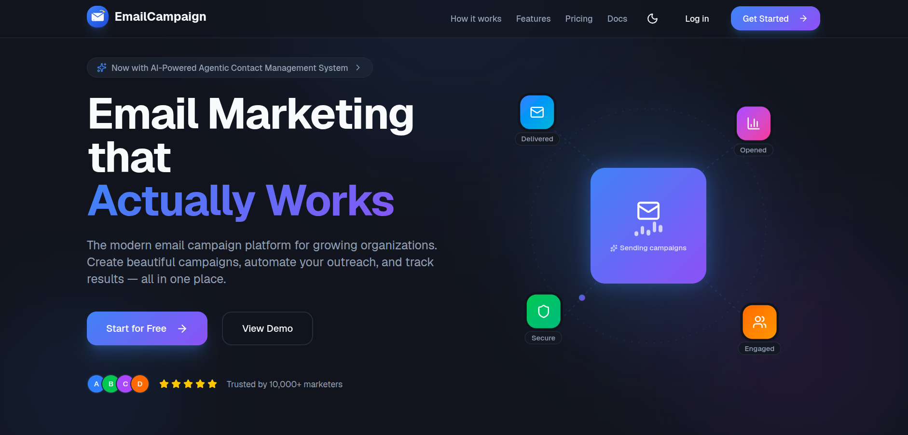

# **Email Campaign Management Platform**

**GitHub Repo Link:** https://github.com/MusfiqDehan/Agentic-Email-Campaign-Management-Platform
 
**Live Demo Link:** https://emailcampaign.musfiqdehan.com

## **Project Overview**

I have built an end-to-end **Email Campaign Management Platform** that allows organizations to manage contacts, create reusable templates, launch bulk email campaigns, and monitor delivery progress from a single system. The platform is designed as a production-style multi-tenant application. Users can onboard organizations, configure providers, import audiences, send campaigns asynchronously, and receive real-time notifications and status updates.

The product also includes **AI-assisted** workflows:

- Generative AI support for email template creation
- Agentic contact management through natural-language and voice-driven commands

---

## **AI Tools Used**

* **Claude Code CLI** – for code generation, problem-solving, and architectural guidance
* **GitHub Copilot** – for real-time code suggestions and productivity improvements

---

## **Key Learnings**

During the development of this platform, I gained hands-on experience in both system design and real-world production challenges:

#### **AI Integration**

* Integrated GenAI features across both frontend and backend within an existing codebase
* Designed workflows for AI-assisted template generation and natural language-driven operations

#### **Email Campaign System Design**

* Studied industry-standard email marketing platforms to understand campaign workflows and best practices
* Implemented dynamic email templates with variables and trigger-based campaign execution
* Built subscriber collection mechanisms using external APIs

#### **Email Infrastructure & Deliverability**

* Integrated **AWS SES** for scalable email automation
* Implemented support for multiple email providers (SES, Gmail SMTP) with dynamic provider selection
* Applied DNS-level configurations (SPF, DKIM, DMARC) to improve deliverability and avoid spam classification

#### **Backend Engineering & Scalability**

* Designed asynchronous email processing using **Celery** for handling bulk email delivery
* Implemented real-time notifications using **WebSockets** for in-app and push notifications

#### **DevOps & Deployment**

* Deployed frontend and backend using **Nginx** on a cloud VPS
* Managed static assets using **AWS S3**
* Built CI/CD pipelines using **GitHub Actions** for automated deployment

#### **Security & Best Practices**

* Implemented unsubscribe mechanisms and email compliance standards
* Applied best practices for secure email template rendering and campaign execution

---

## **Areas for Improvement**

* Expanding support for additional email providers beyond AWS SES and Gmail SMTP
* Extending agentic (AI-driven) capabilities across more complex workflows within the platform
* Enhancing analytics by introducing advanced metrics such as:

  * Open rate
  * Bounce rate
  * Engagement tracking etc.

